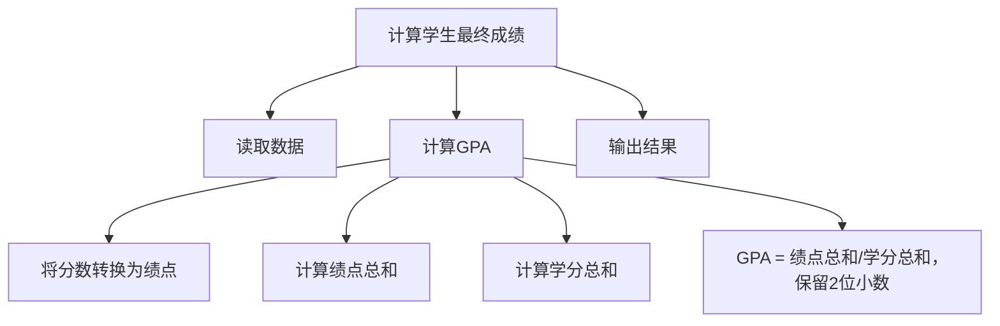
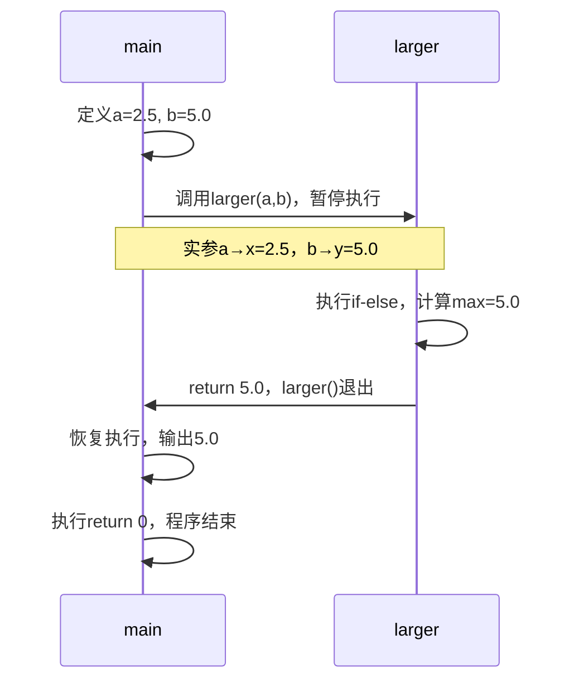

# COMP2113 Module 5 Functions 备考笔记（完整版，基于《Module 5 - Guidance Notes.pdf》）
## 一、文档基础信息与学习目标
### 1.1 文档核心信息
- **课程关联**：COMP2113 Programming Technologies  
- **模块名称**：Module 5: Functions  
- **预计学习时长**：2.5 Hours  
- **核心内容**：自上而下设计（分治法）、预定义与自定义函数、函数定义/调用/声明、控制流、变量作用域、参数传递（值传递/引用传递）  
- **关键特色**：以大量代码示例和执行流程图示为核心，强调“函数是子任务的实现载体”，突出参数传递机制的实际应用场景。

### 1.2 学习目标（Learning Objectives）
- **英文原文**：At the end of this chapter, you should be able to: ① Understand how multiple programs could depend on each other. ② Understand why separate compilation is useful and how to use it. ③ Understand how to use the make tool.  
- **中文译文**：学完本章后，你应能：① 理解自上而下设计（分治法）的思路，将任务拆分为可管理的子任务；② 熟练使用预定义函数（如数学、随机数函数），掌握自定义函数的定义、调用与声明；③ 理解变量作用域规则（局部/全局变量）；④ 区分并应用参数传递机制（值传递/引用传递）。


## 二、自上而下设计（Top-Down Design / Divide and Conquer）
### 2.1 核心思想
- **英文原文**：Break down a task into sub-tasks, decompose sub-tasks into smaller ones until all are manageable. Implement each sub-task as a function to preserve the design structure.  
- **中文译文**：将复杂任务拆分为多个子任务，再将子任务进一步拆分，直到所有子任务都易于实现。每个子任务用**函数**实现，确保程序结构清晰、易维护。

### 2.2 示例：学生最终成绩计算（文档示例）

- **关键原则**：每个模块（函数）仅执行**单一、明确的任务**，便于单独编写、测试和调试。

### 2.3 使用函数的优势
1. **聚焦单一任务**：函数逻辑独立，易构造和调试；  
2. **并行开发**：多人可同时开发不同函数；  
3. **代码复用**：函数编写一次，可在同一程序或不同程序中多次调用；  
4. **简化主函数**：`main()`仅负责整体逻辑，可读性提升。


## 三、预定义函数 vs 自定义函数（Predefined vs. Self-Defined Functions）
### 3.1 预定义函数（Predefined Functions）
#### 3.1.1 核心概念
- **英文原文**：Predefined functions are pre-implemented in C++ libraries (compiled into object codes). To use them, you only need to know: ① Input (parameters) ② Output (return type), and include the corresponding header file.  
- **中文译文**：预定义函数是C++标准库中已实现的函数（已编译为目标代码），使用时无需关注内部逻辑，只需明确“输入参数”和“返回值”，并包含对应的头文件。

#### 3.1.2 常用预定义函数与头文件
| 函数声明（Function Declaration） | 功能（Description） | 所属头文件（Library Header） |
|----------------------------------|--------------------|------------------------------|
| `double sqrt(double x)`          | 计算x的平方根 | `<cmath>` |
| `double pow(double x, double y)` | 计算x的y次幂（xᵞ） | `<cmath>` |
| `double fabs(double x)`          | 计算x的绝对值（浮点数） | `<cmath>` |
| `int abs(int x)`                 | 计算x的绝对值（整数） | `<cstdlib>` |
| `int rand()`                     | 生成[0, RAND_MAX]的伪随机整数 | `<cstdlib>` |
| `void srand(unsigned int seed)`  | 初始化随机数种子 | `<cstdlib>` |
| `time_t time(time_t* timer)`     | 获取当前系统时间（用于生成随机种子） | `<ctime>` |

#### 3.1.3 关键使用示例：随机数生成
文档重点讲解了“伪随机数”的问题及解决方法，步骤如下：
1. **问题**：`rand()`生成的随机数序列固定（伪随机），因默认种子相同；  
2. **解决**：用`srand(seed)`初始化种子，结合`time(NULL)`获取当前系统时间（每次运行时间不同，种子不同）；  
3. **完整代码**：
   ```cpp
   #include <iostream>
   #include <cstdlib>  // 包含rand()、srand()
   #include <ctime>   // 包含time()
   using namespace std;

   int main() {
       // 初始化随机种子：用当前系统时间作为种子
       srand(time(NULL));
       
       // 生成10个[1, 100]的随机整数
       for (int i = 0; i < 10; ++i) {
           // rand()%100 → [0,99]，+1 → [1,100]
           cout << rand() % 100 + 1 << endl;
       }
       return 0;
   }
   ```
- **调试技巧**：若需固定随机序列（便于调试），可手动设置种子（如`srand(0)`），每次运行将生成相同序列。

### 3.2 自定义函数（Self-Defined Functions）
#### 3.2.1 设计函数的三要素
定义函数前需明确以下三点（文档示例：`larger`函数，比较两个浮点数的较大值）：
1. **输入（参数）**：两个浮点数，类型`double`；  
2. **输出（返回值）**：一个浮点数（较大值），类型`double`；  
3. **逻辑（函数体）**：通过`if-else`判断较大值。


## 四、函数定义、调用与声明（Function Definition, Call & Declaration）
### 4.1 函数定义（Function Definition）
#### 4.1.1 结构：函数头 + 函数体
- **英文原文**：A function definition consists of a function header (return type, function name, parameters) and a function body (statements inside `{ }`).  
- **中文译文**：函数定义由“函数头”和“函数体”组成，示例（`larger`函数）：
  ```cpp
  // 函数头：返回类型 double，函数名 larger，参数 double x, double y
  double larger(double x, double y) {
      // 函数体：实现比较逻辑
      double max;
      if (x >= y) {
          max = x;
      } else {
          max = y;
      }
      return max;  // 返回结果（类型需与函数头一致）
  }
  ```

#### 4.1.2 特殊情况：void函数（无返回值）
- **英文原文**：A void function produces no return value. Use `void` as return type; the `return` statement (if used) has no value.  
- **中文译文**：`void`函数无返回值，函数头返回类型为`void`，`return`语句可省略或仅用于提前退出，示例：
  ```cpp
  // 无返回值，仅打印信息
  void print_msg(int x) {
      cout << "This is a void function. Input: " << x << endl;
      // 可省略return，或写 return;（无值）
      return;
  }
  ```

### 4.2 函数调用（Function Call）
#### 4.2.1 核心概念：实参与形参
- **形参（Formal Parameters）**：函数定义中的参数（占位符，如`larger(double x, double y)`中的`x`、`y`）；  
- **实参（Actual Arguments）**：函数调用时传递的实际值（如`larger(2.5, 5.0)`中的`2.5`、`5.0`）；  
- **调用规则**：实参类型/数量需与形参匹配，实参可是常量、变量、表达式甚至函数调用。

#### 4.2.2 调用示例
```cpp
#include <iostream>
using namespace std;

// 函数定义
double larger(double x, double y) {
    return (x >= y) ? x : y;  // 三元运算符：等价于if-else
}

int main() {
    double a = 2.5, b = 5.0, c;
    
    // 1. 实参为变量
    c = larger(a, b);  
    cout << "Larger: " << c << endl;  // 输出5.0
    
    // 2. 实参为表达式
    c = larger(a + 1, b - 2);  // 计算a+1=3.5，b-2=3.0，返回3.5
    cout << "Larger: " << c << endl;
    
    // 3. 实参为函数调用
    c = larger(larger(1.0, 3.0), 4.0);  // 先算inner larger(1.0,3.0)=3.0，再算outer=4.0
    cout << "Larger: " << c << endl;
    
    return 0;
}
```

### 4.3 函数声明（Function Declaration）
#### 4.3.1 为什么需要声明？
- **英文原文**：The compiler needs to know the function prototype (name, parameters, return type) before the function is called. If the function is defined after `main()`, a declaration is required.  
- **中文译文**：编译器在遇到函数调用前，需知道函数的“原型”（名称、参数类型、返回类型）。若函数定义在`main()`之后，必须先声明函数。

#### 4.3.2 声明格式
- **英文原文**：A function declaration is a function header followed by a semicolon; parameter names can be omitted.  
- **中文译文**：函数声明即“函数头 + 分号”，形参名可省略，示例：
  ```cpp
  #include <iostream>
  using namespace std;

  // 函数声明（原型）：形参名可省略（x→a, y→b 或直接省略）
  double larger(double a, double b);  // 或 double larger(double, double);

  int main() {
      double a = 2.5, b = 5.0;
      // 调用函数（此时编译器已通过声明知道函数原型）
      cout << "Larger: " << larger(a, b) << endl;
      return 0;
  }

  // 函数定义（在main之后，需提前声明）
  double larger(double x, double y) {
      return (x >= y) ? x : y;
  }
  ```


## 五、函数调用的控制流（Flow of Control）
### 5.1 核心执行流程（以`main()`调用`larger()`为例）
1. **程序启动**：从`main()`的第一句开始顺序执行；  
2. **遇到函数调用**：`main()`的执行**暂停**，将实参值复制到形参（如`a=2.5`→`x=2.5`，`b=5.0`→`y=5.0`）；  
3. **执行被调函数**：按顺序执行`larger()`的函数体，计算并通过`return`返回结果（`5.0`）；  
4. **返回调用点**：`main()`恢复执行，将返回值赋值给变量或用于表达式；  
5. **程序结束**：执行完`main()`的最后一句，或遇到`return 0`，程序退出。

### 5.2 流程图示（文档核心逻辑提炼）



## 六、变量作用域（Scope of Variables）
### 6.1 局部变量（Local Variables）
#### 6.1.1 核心特性
- **英文原文**：Variables declared inside a function (including parameters) are local. They exist only when the function is called, disappear when exited, and cannot be accessed by other functions.  
- **中文译文**：在函数内声明的变量（含形参）为局部变量，特性如下：
  1. **生命周期**：函数调用时创建，函数退出时销毁；  
  2. **访问权限**：仅在所属函数内可访问，其他函数无法直接使用；  
  3. **同名规则**：不同函数的局部变量可同名（互不影响）。

#### 6.1.2 示例
```cpp
#include <iostream>
using namespace std;

double larger(double x, double y) {
    double max;  // 局部变量：仅larger()内可用
    max = (x >= y) ? x : y;
    return max;
}

int main() {
    double a = 2.5, b = 5.0, max;  // 局部变量：仅main()内可用
    max = larger(a, b);  // 此处max与larger()的max无关联
    cout << "Larger: " << max << endl;  // 输出5.0
    return 0;
}
```

### 6.2 全局变量（Global Variables）
#### 6.2.1 核心特性
- **英文原文**：Variables declared outside all functions are global. They are accessible by all functions, exist permanently, but are not recommended (hard to trace changes).  
- **中文译文**：在所有函数外声明的变量为全局变量，特性如下：
  1. **生命周期**：程序启动时创建，程序结束时销毁；  
  2. **访问权限**：全文件所有函数可访问、修改；  
  3. **优缺点**：无需通过参数传递数据，但修改不可控（调试困难），仅推荐用于**全局常量**。

#### 6.2.2 示例（全局常量的合理使用）
```cpp
#include <iostream>
using namespace std;

// 全局常量（推荐）：全文件可访问，值不可修改
const double PI = 3.14159;

// 全局变量（不推荐）：易被意外修改
double global_var = 10.0;

void calculate_area(double r) {
    // 访问全局常量PI
    double area = PI * r * r;
    cout << "Area: " << area << endl;
    
    // 修改全局变量（风险）
    global_var = 20.0;
}

int main() {
    calculate_area(5.0);  // 输出Area: 78.53975
    cout << "Global var: " << global_var << endl;  // 输出20.0（被修改）
    return 0;
}
```

### 6.3 作用域隐藏规则
- **英文原文**：Variables in an inner block hide identically named variables in outer blocks.  
- **中文译文**：内块（如`if`、`for`的`{ }`）中声明的变量，会“隐藏”外块中同名的变量（内块中仅能访问内块变量），示例：
  ```cpp
  #include <iostream>
  using namespace std;

  int main() {
      int i = 0;  // 外块变量
      cout << "Outer block: i = " << i << endl;  // 输出0
      
      {  // 内块开始
          int i = 100;  // 内块变量，隐藏外块i
          cout << "Inner block: i = " << i << endl;  // 输出100
      }  // 内块结束，内块i销毁
      
      cout << "Outer block: i = " << i << endl;  // 输出0（外块i恢复）
      return 0;
  }
  ```


## 七、参数传递机制（Parameter Passing）
### 7.1 值传递（Pass-by-Value）
#### 7.1.1 核心逻辑
- **英文原文**：The value of the argument is copied to the formal parameter. Changes to the parameter are local and do not affect the argument.  
- **中文译文**：实参的值**复制**到形参，函数内对形参的修改仅在函数内有效，不影响实参本身。

#### 7.1.2 示例：`square`函数（值传递无效场景）
```cpp
#include <iostream>
using namespace std;

// 值传递：形参x是实参a的副本
void square(int x) {
    x *= x;  // 修改副本，实参a不变
    cout << "Inside square: x = " << x << endl;  // 输出100
}

int main() {
    int a = 10;
    square(a);
    cout << "Inside main: a = " << a << endl;  // 输出10（实参未变）
    return 0;
}
```

### 7.2 引用传递（Pass-by-Reference）
#### 7.2.1 核心逻辑
- **英文原文**：The formal parameter refers to the same memory cell as the argument. Changes to the parameter affect the argument (arguments must be variables).  
- **中文译文**：形参通过`&`绑定实参的内存地址，与实参共享同一内存空间，函数内对形参的修改会直接影响实参（实参必须是变量，不能是常量/表达式）。

#### 7.2.2 语法：形参前加`&`
#### 7.2.3 示例1：`square`函数（引用传递生效）
```cpp
#include <iostream>
using namespace std;

// 引用传递：形参x绑定实参a的内存
void square(int &x) {
    x *= x;  // 修改x即修改a
    cout << "Inside square: x = " << x << endl;  // 输出100
}

int main() {
    int a = 10;
    square(a);
    cout << "Inside main: a = " << a << endl;  // 输出100（实参被修改）
    return 0;
}
```

#### 7.2.4 示例2：`swap`函数（引用传递的典型场景）
```cpp
#include <iostream>
using namespace std;

// 引用传递：交换两个变量的值
void swap(int &a, int &b) {
    cout << "Before swap: a = " << a << ", b = " << b << endl;  // 输出0, 100
    int temp = a;
    a = b;
    b = temp;
    cout << "After swap: a = " << a << ", b = " << b << endl;  // 输出100, 0
}

int main() {
    int x = 0, y = 100;
    swap(x, y);
    cout << "In main: x = " << x << ", y = " << y << endl;  // 输出100, 0（实参已交换）
    return 0;
}
```

### 7.3 两种传递机制的对比
| 特性                | 值传递（Pass-by-Value）       | 引用传递（Pass-by-Reference） |
|---------------------|------------------------------|------------------------------|
| 数据传递方式        | 复制实参值到形参              | 形参绑定实参内存              |
| 实参是否被修改      | 不修改                       | 可修改                       |
| 实参类型限制        | 可是常量、变量、表达式        | 必须是变量                    |
| 适用场景            | 仅需使用实参值，无需修改      | 需修改实参（如交换、返回多值） |
| 函数返回值需求      | 需通过`return`返回结果        | 结果可直接存于实参，无需返回  |


## 八、快速练习与答案（文档关键示例）
### 8.1 快速练习1
```cpp
#include <iostream>
using namespace std;

void figureMeOut(int &x, int y, int &z) {
    cout << x << ' ' << y << ' ' << z << endl;  // 输出10 20 30
    x = 1;  // 修改引用参数x（影响实参a）
    y = 2;  // 修改值参数y（不影响实参b）
    z = 3;  // 修改引用参数z（影响实参c）
    cout << x << ' ' << y << ' ' << z << endl;  // 输出1 2 3
}

int main() {
    int a = 10, b = 20, c = 30;
    figureMeOut(a, b, c);
    cout << a << ' ' << b << ' ' << c << endl;  // 输出1 20 3
    return 0;
}
```

### 8.2 输出结果
```
10 20 30
1 2 3
1 20 3
```


## 九、核心考点总结（Key Exam Focus）
1. **自上而下设计**：分治法拆分任务，函数对应子任务，优势是易维护、可复用；  
2. **预定义函数**：  
   - 常用函数与头文件（`cmath`的`sqrt`/`pow`，`cstdlib`的`rand`/`srand`）；  
   - 随机数生成步骤：`srand(time(NULL))`初始化种子 + `rand()%范围`生成指定区间随机数；  
3. **自定义函数**：  
   - 定义结构：函数头（返回类型、名、参数）+ 函数体；  
   - 声明的必要性：函数定义在`main()`之后时，需提前声明原型；  
   - 调用规则：实参类型/数量与形参匹配，实参可是表达式/函数调用；  
4. **变量作用域**：  
   - 局部变量：函数内有效，生命周期与函数调用绑定；  
   - 全局变量：不推荐（易修改），仅全局常量（`const`）合理；  
   - 隐藏规则：内块变量隐藏外块同名变量；  
5. **参数传递**：  
   - 值传递：复制，不修改实参，适用于仅用值的场景；  
   - 引用传递：`&`绑定内存，修改实参，适用于交换、返回多值的场景；  
   - 区分技巧：看形参是否有`&`，有则为引用传递。